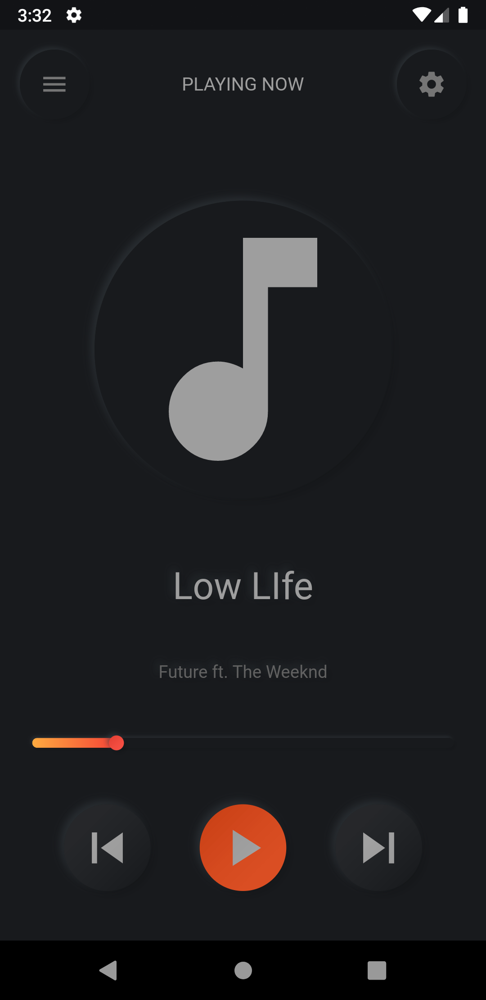

# neumorphic_app

A new Flutter project.
Neumorphism also called Skeuomorphism UI trend is a term most often used in graphical user interface design to describe interface objects that mimic their real-world counterparts in how they appear and/or how the user can interact with them.

## 👀 Showcases

## Getting Started

This project is a starting point for a Flutter application.

A few resources to get you started if this is your first Flutter project:

- [Lab: Write your first Flutter app](https://flutter.dev/docs/get-started/codelab)
- [Cookbook: Useful Flutter samples](https://flutter.dev/docs/cookbook)

For help getting started with Flutter, view our
[online documentation](https://flutter.dev/docs), which offers tutorials,
samples, guidance on mobile development, and a full API reference.
